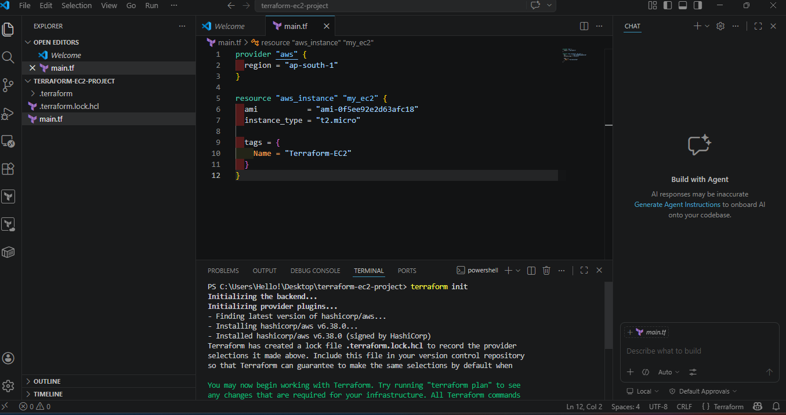
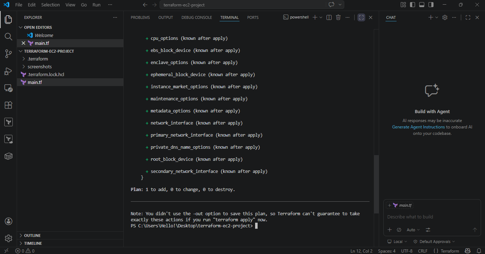
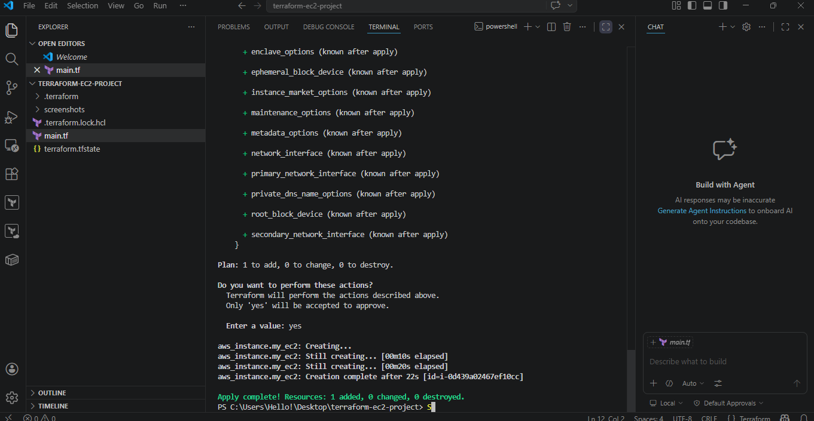
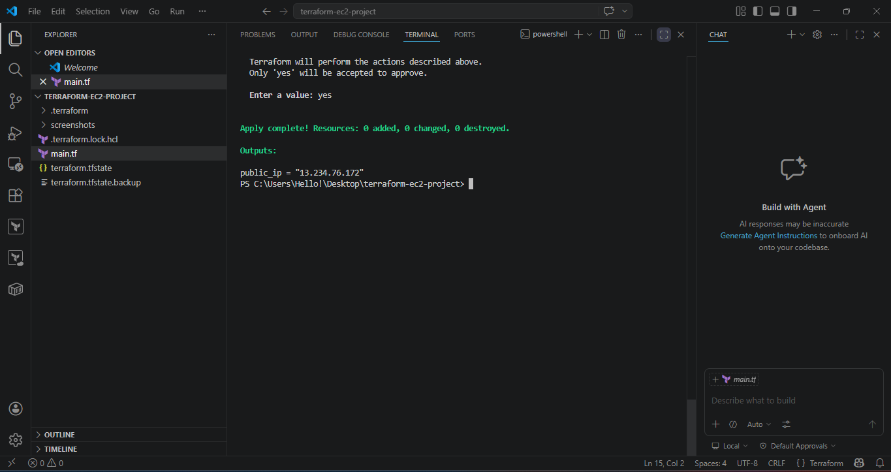
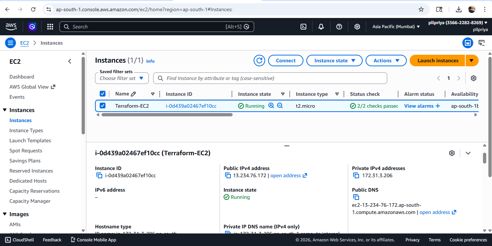
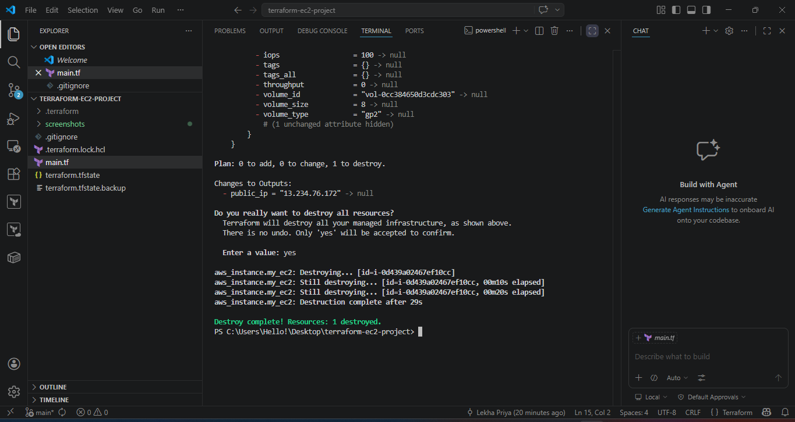

🚀 Terraform EC2 Deployment Project

📌 Project Overview

This project demonstrates how to provision an AWS EC2 instance using Terraform. It uses Infrastructure as Code (IaC) principles.

---

🛠️ Tools Used

- Terraform
- AWS EC2
- Git & GitHub
- VS Code

---

⚙️ What I Did

- Created EC2 instance using Terraform
- Used ap-south-1 region
- Configured instance type t2.micro
- Retrieved public IP using output

---

🚀 Commands Used

terraform init
terraform plan
terraform apply
terraform destroy

---

### Screenshots

#### Terraform Init

#### Terraform Plan

#### Terraform Apply

#### Output Public IP

#### EC2 Instance Running

#### Terraform Destroy

---

👩‍💻 Author
Lekha Priya
